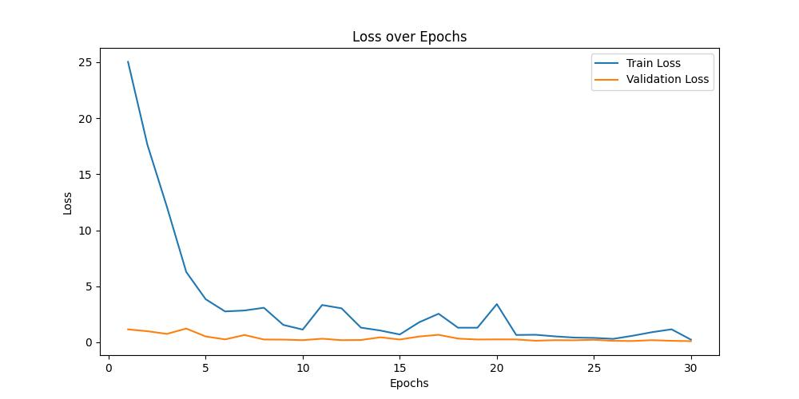
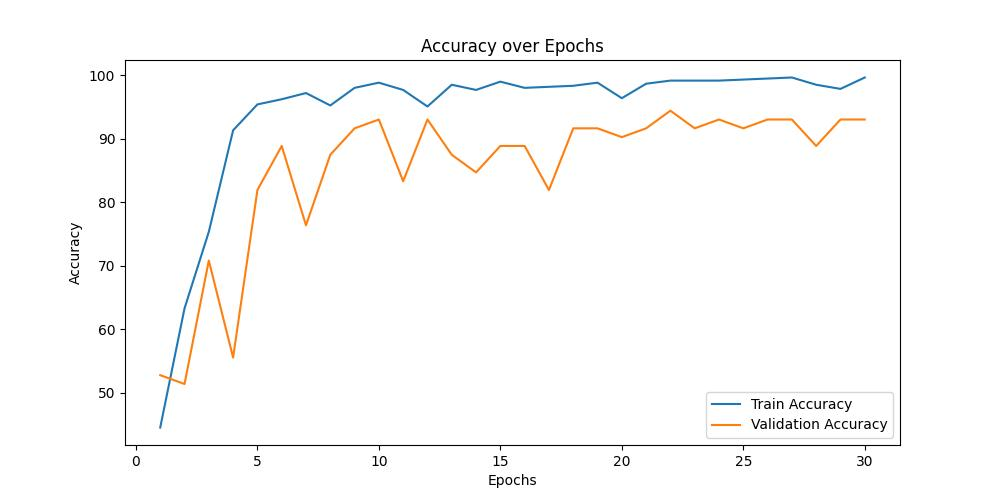
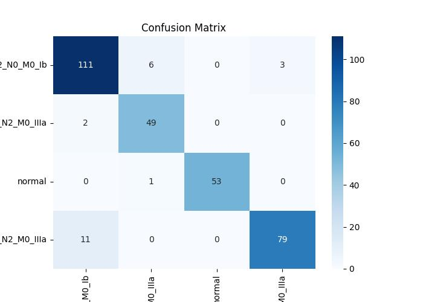

# 🩺 CT Scan Classification Model

[](https://www.python.org/downloads/)
[](https://pytorch.org/)
[](LICENSE)
[](https://www.kaggle.com/datasets/mohamedhanyyy/chest-ctscan-images)

A deep learning project for automated classification of chest CT scan images using PyTorch. This repository implements improved versions of DenseNet and VGG19 architectures with comprehensive data augmentation and evaluation pipelines.

## 📋 Table of Contents

- [Overview](#-overview)
- [Features](#-features)
- [Project Structure](#-project-structure)
- [Installation](#-installation)
- [Dataset](#-dataset)
- [Usage](#-usage)
- [Model Architectures](#-model-architectures)
- [Results](#-results)
- [Configuration](#-configuration)
- [System Requirements](#-system-requirements)
- [License](#-license)

## 🎯 Overview

This project focuses on developing robust deep learning models for chest CT scan image classification. The system can automatically categorize CT scan images into different chest conditions, providing valuable assistance for medical diagnosis and research.

### Key Capabilities:
- **Multi-class Classification**: Distinguish between various chest conditions
- **Transfer Learning**: Leverage pre-trained models for better performance
- **Data Augmentation**: Comprehensive image transformations for improved generalization
- **Automated Evaluation**: Complete pipeline with metrics and visualizations

## ✨ Features

- 🔧 **Multiple Model Architectures**: DenseNet121 and VGG19 with custom improvements
- 🎨 **Advanced Data Augmentation**: Random flips, rotations, color jittering
- 📊 **Comprehensive Evaluation**: Loss curves, accuracy plots, confusion matrices
- 🚀 **Easy Training Pipeline**: One-command training with configurable parameters
- 📈 **Real-time Monitoring**: Progress tracking and performance visualization
- 🔄 **Automated Dataset Management**: Direct download from Kaggle

## 📁 Project Structure

```
ct-scan-model/
├── 📄 main.py                    # Main training script
├── 📄 dataset_download.py        # Dataset download utility
├── 📄 requirements.txt           # Python dependencies
├── 📄 LICENSE                    # MIT License
├── 📄 .gitignore                 # Git ignore rules
├── 🗂️ model/
│   ├── __init__.py
│   └── model.py                  # Model architectures
├── 🗂️ dataloader/
│   └── dataloader.py             # Data loading & preprocessing
├── 🗂️ trainer/
│   └── trainer.py                # Training & evaluation logic
├── 🗂️ utils/
│   ├── plot.py                   # Visualization utilities
│   ├── config.py                 # Configuration management
│   └── argument_parser.py        # Command-line arguments
├── 🗂️ dataset/                  # Dataset directory (auto-created)
└── 🗂️ results/                  # Generated outputs
    ├── 📊 Accuracy_graph.jpg
    ├── 📊 Loss_graph.jpg
    └── 📊 confusion_matrix.jpg
```

## 🛠️ Installation

### Prerequisites
- Python 3.8 or higher
- CUDA-compatible GPU (optional, for faster training)
- 8GB+ RAM recommended
- 2GB+ free disk space

### Setup Instructions

1. **Clone the repository**
   ```bash
   git clone https://github.com/yourusername/ct-scan-model.git
   cd ct-scan-model
   ```

2. **Create virtual environment** (recommended)
   ```bash
   python -m venv venv
   source venv/bin/activate  # On Windows: venv\Scripts\activate
   ```

3. **Install dependencies**
   ```bash
   pip install -r requirements.txt
   ```

4. **Set up Kaggle API** (for dataset download)
   ```bash
   pip install kaggle
   ```
   - Get your API credentials from [Kaggle Settings](https://www.kaggle.com/settings/account)
   - Download `kaggle.json` and place it in `~/.kaggle/` directory
   - Set permissions: `chmod 600 ~/.kaggle/kaggle.json`

## 📊 Dataset

The project uses the [Chest CT-Scan Images Dataset](https://www.kaggle.com/datasets/mohamedhanyyy/chest-ctscan-images) from Kaggle, containing CT scan images categorized into different chest conditions.

### Download Dataset
```bash
python dataset_download.py
```

This script will:
- ✅ Download the dataset from Kaggle
- ✅ Extract it to the `dataset/` directory
- ✅ Organize into train/test/validation splits
- ✅ Clean up temporary files

## 🚀 Usage

### Basic Training

Run the model with default parameters:
```bash
python main.py
```

### Advanced Training with Custom Parameters

```bash
python main.py \
    --batch_size 32 \
    --lr 0.0001 \
    --num_epoch 30 \
    --model_name densenet
```

### Command-line Arguments

| Parameter | Default | Description |
|-----------|---------|-------------|
| `--batch_size` | 32 | Training batch size |
| `--lr` | 0.0001 | Learning rate |
| `--num_epoch` | 10 | Number of training epochs |
| `--model_name` | densenet | Model architecture (densenet/vgg) |

## 🧠 Model Architectures

### ImprovedDenseNetCTScan
- **Backbone**: DenseNet121 (pre-trained)
- **Classifier**: Custom 3-layer architecture
- **Features**: 1024 → 128 → num_classes
- **Regularization**: Dropout (0.3, 0.1)

### ImprovedVGG19CTScan
- **Backbone**: VGG19 (pre-trained)
- **Classifier**: Custom 3-layer architecture
- **Features**: 4096 → 1024 → 128 → num_classes
- **Regularization**: Dropout (0.3, 0.1)

## 📈 Results

The training process automatically generates comprehensive visualizations and metrics:

### Training Progress Visualization

#### Loss Curves

*Training and validation loss over epochs - helps identify overfitting and convergence patterns*

#### Accuracy Curves

*Training and validation accuracy progression - shows model learning and generalization*

#### Confusion Matrix

*Detailed classification performance across all classes - visualizes true/false predictions*

### Generated Metrics
- **Training/Validation Loss**: Track model convergence
- **Training/Validation Accuracy**: Monitor performance improvement
- **Confusion Matrix**: Class-wise performance analysis
- **Classification Report**: Precision, recall, F1-score for each class

## ⚙️ Configuration

### Data Augmentation Pipeline

```python
# Training Transforms
- Resize: (IMG_SIZE, IMG_SIZE)
- Random Horizontal Flip: p=0.5
- Random Rotation: ±10 degrees
- Color Jitter: brightness=0.2, contrast=0.2
- Normalization: ImageNet statistics
```

### Training Configuration

- **Optimizer**: Adam
- **Loss Function**: CrossEntropyLoss
- **Device**: Auto-detects CUDA/CPU
- **Validation**: Per-epoch evaluation

## 💻 System Requirements

| Component | Minimum | Recommended |
|-----------|---------|-------------|
| **Python** | 3.8 | 3.9+ |
| **RAM** | 4GB | 8GB+ |
| **Storage** | 1GB | 2GB+ |
| **GPU** | CPU only | CUDA-compatible |
| **OS** | Linux/macOS/Windows | Linux |

## 📝 License

This project is licensed under the [MIT License](LICENSE) - see the [LICENSE](LICENSE) file for details.


## 🙏 Acknowledgments

- **Dataset**: [Mohamed Hany](https://www.kaggle.com/mohamedhanyyy) for the Chest CT-Scan Images Dataset
- **Framework**: PyTorch and torchvision for deep learning capabilities
- **Community**: Open-source contributors and researchers in medical imaging